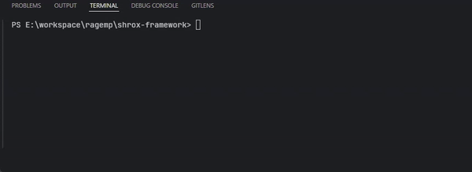

# RAGEMP RP FRAMEWORK

A RAGE MULTIPLAYER Roleplay framework.

# Introduction
>
This game mode is still a work in progress, plenty features are planned to be added and a proper roadmap will be published later on.


# Built in
>
**Client Side**:<br>
* [Webpack](https://webpack.js.org/)
* [Typescript](https://www.typescriptlang.org/) 

**Backend**<br>
* [Typescript](https://www.typescriptlang.org/) 
* [PostgreSQL](https://www.postgresql.org/)
* [TypeORM](https://typeorm.io/)<br>


**Frontend**
* [Typescript](https://www.typescriptlang.org/) 
* [React](https://react.dev/)
* [React Rewire](https://www.npmjs.com/package/react-app-rewired)
* [MobX](https://mobx.js.org/README.html)

>
Credits<br>
Thanks to rootcause for [Command Registry](https://rage.mp/files/file/375-improved-commands/)<br>
Thanks to Morbo for [NoClip](https://rage.mp/files/file/163-noclip/)

# Current Features
 - Account system (Login/Register).
 - Chat System
 - Command system
 #

# Getting started with server development
>
**Introduction:**<br>


>
**Database setup:**<br>
This code requires you to have PostgreSQL installed on your machine, [read more](https://www.postgresql.org/).<br>
After installing posgree, connect to your database using [PGAdmin](https://www.pgadmin.org/) or [HeidiSQL](https://www.heidisql.com/) and create a new database by executing a query like:
```
CREATE DATABASE mydb;
```
After creating a database successfully, head back to the server files and edit .env by describing the database connection details there.
Once you're setup with that, simply start the server, and the TypeORM will start creating the required database tables on its own (see Database.module.ts for deeper info)
>
**Code structure**

```sh
+---client_packages #contains server & client source code
|   +---package2 # this folder contains the build code of frontend
|   +---app.js # the output after building/watching client-side code
|   +---index.js # a default index file to load app.js or other files within this folder
+---backend #contains server & client source code
|   +---client #client side source code
|   |   +---assets
|   |   +---classes
|   |   +---clientevents
|   |   \---modules
|   \---server #server side source code
|       +---@types
|       +---classes
|       +---commands
|       +---database
|       |   \---entity
|       +---modules
|       +---prototype
|       +---serverevents
|       \---utils
+---frontend #contains frontend (CEF) source code
|   +---public
|   \---src
|       +---assets #holds frontend assets such as images/videos
|       +---events # holds frontend events that can be called from server/client
|       +---pages # holds pages which we display to the players in game
|       +---stores # holds stores which we use as temporary storage for as long as the player is in game
|       +---styles # contains styling code
|       \---utils # contains utils and code helpers
\---shared # contains shared data across backend and frontend
```
>
**Starting the server in development mode:**<br>
Client side:<br>
<br>
Server side<br>

