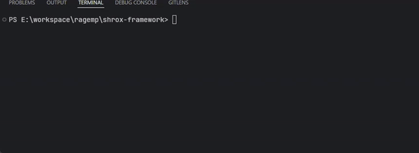

# Getting Started with Server Development

> **Introduction:**<br>

> **Database setup:**<br>
This code requires you to have PostgreSQL installed on your machine, [read more](https://www.postgresql.org/).<br>
After installing PostgreSQL, connect to your database using [PGAdmin](https://www.pgadmin.org/) or [HeidiSQL](https://www.heidisql.com/) and create a new database by executing a query like:

```
CREATE DATABASE mydb;
```

After creating a database successfully, head back to the server files and edit `.env` by describing the database connection details there.
Once you're set up with that, simply start the server, and TypeORM will start creating the required database tables on its own (see `Database.module.ts` for deeper info).

> **Code structure**

```sh
+---client_packages #contains server & client source code
|   +---package2 # this folder contains the build code of frontend
|   +---app.js # the output after building/watching client-side code
|   +---index.js # a default index file to load app.js or other files within this folder
+---backend #contains server & client source code
|   +---client #client side source code
|   |   +---assets
|   |   +---classes
|   |   +---clientevents
|   |   \---modules
|   \---server #server side source code
|       +---@types
|       +---classes
|       +---commands
|       +---database
|       |   \---entity
|       +---modules
|       +---prototype
|       +---serverevents
|       \---utils
+---frontend #contains frontend (CEF) source code
|   +---public
|   \---src
|       +---assets #holds frontend assets such as images/videos
|       +---events # holds frontend events that can be called from server/client
|       +---pages # holds pages which we display to the players in game
|       +---stores # holds stores which we use as temporary storage for as long as the player is in game
|       +---styles # contains styling code
|       \---utils # contains utils and code helpers
\---shared # contains shared data across backend and frontend
```

> **Starting the server in development mode:**<br>
Client side:<br>
<br>
Server side<br>


---

# Getting Started with the Frontend

The `frontend` directory in the `ragemp-rp-gamemode` repository contains the client-side code responsible for the user interface and interactions within the game. This frontend is built using modern web technologies, including React with TypeScript, and is bundled using Webpack.

## Prerequisites

Before setting up the frontend, ensure you have the following installed on your system:

- **Node.js** (v14 or higher)
- **npm** (v6 or higher)

You can verify your installations by running:

```bash
node -v
npm -v
```

## Setting Up the Frontend

1. **Navigate to the Frontend Directory**:

   Open your terminal and change to the `frontend` directory:

   ```bash
   cd path/to/ragemp-rp-gamemode/frontend
   ```

2. **Install Dependencies**:

   Install the required Node.js packages using npm:

   ```bash
   npm install
   ```

   This command installs all dependencies listed in `package.json`.

3. **Build the Frontend**:

   After installing the dependencies, build the frontend assets:

   ```bash
   npm run build
   ```

   This command compiles the TypeScript and React code into JavaScript and bundles it using Webpack.

4. **Deploy the Built Assets**:

   Once the build is complete, the compiled assets need to be placed in the appropriate directory for the RAGE Multiplayer server to serve them. That said, our current frontend build is setup to automatically create a package2/dist folder in client_packages if it doesn't exist and move all built files in there.

## Running in Development Mode

For development purposes, you might want to run the frontend in watch mode to automatically rebuild on code changes.

1. **Start the Development Server**:

   While in the `frontend` directory, execute:

   ```bash
   npm run dev
   ```

   This starts the development server, which watches for file changes and rebuilds the project as needed.


## Additional Resources

- **React Documentation**: [https://reactjs.org/docs/getting-started.html](https://reactjs.org/docs/getting-started.html)
- **TypeScript Documentation**: [https://www.typescriptlang.org/docs/](https://www.typescriptlang.org/docs/)
- **Webpack Documentation**: [https://webpack.js.org/concepts/](https://webpack.js.org/concepts/)


## Example
>
Check CEF handler docs to find out how to create a page. [Click here](https://github.com/shr0x/ragemp-rp-gamemode/blob/main/docs/cefhandler.md)


* By following these steps, you can set up and run the frontend portion of the `ragemp-rp-gamemode`, allowing you to develop and customize the client-side experience of your roleplay server.

